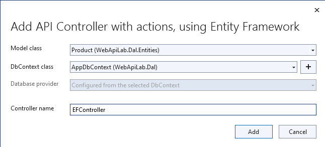

# ASP.NET Core webszolgáltatások I.-II.

## Kiinduló projektek beüzemelése

Klónozzuk le a publikus kiinduló projektet a GitHub-ról az alábbi paranccsal:

``` cmd
git clone https://github.com/bmeviauav23/WebApiLab-kiindulo.git
```

A kiinduló solution két .NET 8 osztálykönyvtárat foglal magába, melyek egy N-rétegű architektúra egy-egy rétegét valósítják meg:

- **WebApiLab.Dal**: lényegében az Entity Framework gyakorlatok anyagát tartalmazza, ez az adatelérési rétegünk.
    - entitásdefiníciók
    - kontext, modellkonfigurációval, kezdeti adatokkal
    - connection string kezelés és SQL naplózás a korábbi gyakorlatok alapján
    - migráció (még) nincs
- **WebApiLab.Bll**: ezt szánjuk az üzleti logikai rétegnek. Fő feladata, hogy a DAL-ra építve végrehajtsa az `Interfaces` mappában definiált műveleteket.
    - Interfaces - ez a BLL réteg specifikációja
    - Services - ide kerülnek majd az üzleti logikát, ill. az interfészeket megvalósító osztály(ok)
    - Dtos - csak később lesz szerepük, egyelőre nincsenek használva
    - Exceptions - saját kivétel osztály, egyelőre nincs használva

Adjunk hozzá a solution-höz egy új C# nyelvű web API projektet (ASP.NET Core Web **API**, nem pedig Web App), a neve legyen `WebApiLab.Api`.

A következő dialógusablakban válasszuk ki a *.NET 8* opciót. Az extrák közül **ne** kérjük ezeket: HTTPS, Docker, authentikáció. Viszont hagyjuk bepipálva a Controller és az OpenAPI támogatást. A generált projektből törölhetjük a minta API fájljait, azaz a `Weather` kezdetű fájlokat a projekt gyökeréből és a `Controllers` mappából.

Adjuk hozzá függőségként:

- a *BLL* projektet (menu:projekten jobbklikk\[Dependencies \> Add Project Reference…\])
- a *Microsoft.EntityFrameworkCore.Tools* NuGet csomagot. Válasszunk olyan verziót, ami egyezik a DAL projekt Entity Framework Core függőségének verziójával.

!!! warning Microsoft csomagok verziózása
    Olyan csomagoknál, ahol a verziószámozás követi az alap keretrendszer verziószámozását, törekedjünk arra, hogy a csomagok verziói konzisztensek legyenek egymással és a keretrendszer verziójával is - akkor is, ha egyébként a függőségi szabályok engednék a verziók keverését.
    Ha a projektünk például .NET 8-os keretrendszert használ, akkor az Entity Framework Core és egyéb extra ASP.NET Core csomagok közül is olyan verziót válasszunk, ahol legalább a főverzió egyezik, tehát valamilyen 8.x verziót. Ez nem azt jelenti, hogy az inkonzisztens verziók mindig hibát eredményeznek, inkább a projekt általában stabilabb, ha a főverziók közötti váltást egyszerre, külön migrációs folyamat ([példa](https://learn.microsoft.com/en-us/aspnet/core/migration/31-to-60)) keretében végezzük.

## Az EF bekötése az ASP.NET Core DI, naplózó, konfiguráló rendszereibe

A kontext konfigurálása az EF gyakorlat során - mivel ott egy sima konzol alkalmazást írtunk - a kontext `OnConfiguring` függvényében történt.
Mivel az ASP.NET Core projekt beépítetten DI konténert is ad a számunkra, érdemes a kontextet a DI rendszerbe regisztrálni, hogy a projekten belül a modulok/osztályok függőségként tudják használni.
A regisztrálás a legfelső szintű kódban történik (lásd ASP.NET Core bevezető gyakorlatot).

A kontext regisztrálása a legfelső szintű kódban a DI konténerbe:

``` csharp
builder.Services.AddDbContext<AppDbContext>(o =>
    o.UseSqlServer(builder.Configuration.GetConnectionString("DefaultConnection")));
```

Az EF naplózást az ASP.NET Core naplózó rendszere végzi, amit a kiinduló builder már inicializál, így ezzel kapcsolatban nincs teendőnk.
Viszont egy új kontext konstruktorra lesz szükségünk, ami `DbContextOptions<AppDbContext>`-et vár.

A kontext `OnConfiguring`-jára pedig nincs szükség, úgyhogy töröljük ki, helyére tegyük az új konstruktort:

``` csharp
public AppDbContext(DbContextOptions<AppDbContext> options)
    : base(options)
{
}
```

Az Entity Framework gyakorlat alapján hozzunk létre egy új LocalDB adatbázist egy választott névvel, pl. neptun kód, northwind, stb. Az SQL Server Object Explorer-ből a connection string-et lopjuk el. (menu:nyissuk le az adatbáziskapcsolatot\[jobbklikk az adatbázison \> Properties \> a Properties ablakból a *Connection String* értéke\]).

Az *appsettings.Development.json*-ba vegyük fel a connection string-et és a generált SQL megfigyeléséhez a *Microsoft* kategóriájú naplók minimum szintjét csökkentsük *Information*-re.

``` json hl_lines="5 7-10"
{
  "Logging": {
    "LogLevel": {
      "Default": "Information",
      "Microsoft": "Information",
    }
  }, //vessző bekerült
  "ConnectionStrings": {
     "DefaultConnection": "<connection string>"
  }
}
```

!!! warning "Escapelt karakterek"
    Kukac (`@`) ilyenkor nem kell a connection string elé, mert ez JSON.

    A connection string különleges karaktereit a beillesztés után a VS alapesetben automatikusan escape-eli. Ha az automatikus escape-elés mégsem történik meg, manuálisan kell ezt megtennünk, különben *A network-related or instance-specific error occurred while establishing a connection to SQL Server* hibát kaphatunk.
    
    Az adatbáziskapcsolatot azért kellhet lenyitni, hogy az SQL Server Object Explorer csatlakozzon is az új adatbázishoz, ezután tudjuk megszerezni a connection stringet.

### Adatbázis inicializálása Code-First migrációval

Fordítsuk a teljes solution-t, állítsuk be indítandó (startup) projektnek az új Web API projektet (menu:jobbklikk a projekten\[Set as Startup Project\]).
A *Package Manager Console*-t nyissuk meg, és állítsuk be Default Project-ként a DAL projektet.

.NET 8-ban a migrációk csak akkor [működnek rendesen](https://github.com/dotnet/SqlClient/issues/2239), ha az API projekten kikapcsoljuk az InvariantGlobalization beállítást. Ezt a *WebApiLab.Api.csproj* fájlban tehetjük meg:

``` xml
<InvariantGlobalization>false</InvariantGlobalization>
```

Készíttessük el a migrációt és futtassuk is le:

``` powershell
Add-Migration Init
Update-Database
```

!!! warning "Projektek a migrációhoz"
    Fontos, hogy a fenti parancs két projektet ismerjen: azt, amelyikben a kontext van, ill. a kontextet használó futtatható projektet.
    A VS Package Manager Console-jában futtatva alapértelmezésben az előbbit a Default Project értéke adja meg, utóbbit az indítandó projekt.
    Továbbá ezeket a projekteket meg lehet adni [paraméterként](https://docs.microsoft.com/en-us/ef/core/miscellaneous/cli/powershell#common-parameters) is.

!!! note "Migráció során lefut a Program.cs is?"
    Igen, itt mutatkozik meg, hogy a migráció lényegében egy teljes alkalmazásindítást jelent a `Program` osztályon keresztül: inicializálódik a DI konténer, a konfigurációs objektum stb.

Ellenőrizzük az SQL Server Object Explorer-ben, hogy rendben lefutott-e a migráció, létrejöttek-e az adatbázis objektumok, feltöltődtek-e a táblák.

## EF entitások használata az API felületen

Bár architektúra szempontból nem a legszebb, a BLL réteget gyakorlatilag mellőzve közvetlenül is használhatjuk az EF entitásokat a kontrollerek megvalósításánál. Ehhez használhatjuk a Visual Studio Entity Framework-ös Controller sablonjait, amit most csak azért használunk, hogy gyorsan legyen egy működő API felületünk.

Adjunk hozzá egy új Controllert a *Controllers* mappába (menu:Add\[Controller \> bal fában Common \> API \> jobb oldalon API Controller with read/write actions\]) `EFProductController` néven.

<figure markdown>

</figure>

Válasszuk ki az `AppDbContext`-t, és a `Product` entitást. Az új kontrollerben már láthatjuk is a scaffoldolt CRUD műveleteket.

<figure markdown>

</figure>

!!! warning "névterek"
    Figyeljünk rá, hogy **ne** a `Dtos` névtérből adjuk meg a DTO típust a tényleges entitástípus helyett.

!!! warning "Generálás hibára fut"
    A generálás során *Unable to create an object of type `AppDbContext`.* hibát kaphatunk. A hiba a kódgeneráló eszközben keresendő, a [kapcsolódó GitHub issue-ban](https://github.com/dotnet/Scaffolding/issues/1875) találunk egy lehetséges megoldást is a problémára, ami elő van készítve a kiinduló projektben is.

A legenerálódó kontroller már használható is. Állítsuk át a zöld nyíl mellett az indítási konfigurációt a projektnevesre, hogy ne IIS Express induljon és így lássuk a konzolon a naplót.
Indítsuk a projektet és próbáljuk például lekérni az összes terméket az **api/efproduct** címről vagy a Swagger felületről.

<figure markdown>

</figure>

!!! tip "Böngésző választása debugoláshoz"
    Érdemes a zöld nyíl melletti lenyíló menüben olyan böngészőt megadni (Chrome, Firefox), ami értelmes formában meg tudja jeleníteni a nyers JSON adatokat, ha nem Swagger felületről tesztelünk.

!!! tip "Alapértelmezett URL útvonal"
    Az alapértelmezésben megnyitandó URL útvonalat a projekt tulajdonságok között adhatjuk meg: menu:zöld nyíl melletti legördülő menü\[\<Projektnév\> Debug Properties\].
    Ide egy a gyökércímhez képesti relatív útvonalrészt kell beírni. (pl. *api/efproduct*)

Figyeljük meg, hogy a controller a konstruktorban igényli meg a DI-tól az EF kontextet, amit a szokásos módon osztályváltozóban tárol el.

## Köztes réteg alkalmazása

A rétegezett architektúra elveit követve gyakori eljárás, hogy a kontroller nem éri el közvetlenül az EF kontextet, hanem csak egy extra rétegen keresztül. A kontroller projekt így függetleníthető az EF modelltől.

Ehhez a megoldáshoz készítsünk külön kontroller változatot. A *Controllers* mappába hozzunk létre egy kontrollert (menu:Add\[Controller \> bal fában Common \> API \> jobb oldalon API Controller with read/write actions\]) `ProductsController` néven.

A BLL projekt Services mappájába hozzunk létre egy új osztályt `ProductService` néven.
Az új osztály kontroller számára nyújtandó funkcióit az `IProductService` adja meg.

Implementáljuk ezt az interfészt, a kiinduló implementációt generáltassuk a Visual Studio-val.
Konstruktorban várja a függőségként a kontextet.
A kontext segítségével implementáljuk normálisan a `GetProducts` függvényt.
Eager Loading* használatával az egyes termékekhez a kapcsolódó kategóriát és megrendeléseket is adjuk vissza.

``` csharp
public class ProductService : IProductService
{
    private readonly AppDbContext _context;

    public ProductService(AppDbContext context)
    {
        _context = context;
    }

    public List<Product> GetProducts()
    {
        var products = _context.Products
            .Include(p => p.Category)
            .Include(p => p.ProductOrders)
                .ThenInclude(po => po.Order)
            .ToList();

        return products;
    }
    /*Többi függvény generált implementációja*/
}
```

Injektáljunk `IProductService`-t a `ProductsController`-be.

``` csharp
private readonly IProductService _productService;

public ProductsController(IProductService productService)
{
    _productService = productService;
}
```

Adjuk meg a DI alrendszernek, hogy hogyan kell egy `IProductService` típusú függőséget létrehozni. A legfelső szintű kódba:

``` csharp
builder.Services.AddTransient<IProductService, ProductService>();
```

A függőséginjektálás úgy működik, hogy a kontrollereket is a központi DI komponens példányosítja, és ilyenkor megvizsgálja a konstruktor paramétereket.
Ha a konténerben talál alkalmas beregisztrált osztályt, akkor azt létrehozza és átadja a konstruktornak.
Ezt hívjuk konstruktor injektálásnak.
Ha a létrehozandó függőségnek is vannak konstruktor paraméterei, akkor azokat is megpróbálja feloldani, így rekurzívan a teljes függőségi objektum hierarchiát le tudja kezelni (ha abban nincs irányított kör).
Ezt hívjuk autowiring-nek.

A regisztráció során több lehetőségünk is van.
Egyrészt nem kötelező interfészt megadni egy osztály beregisztrálásához, az osztályt önmagában is be lehet regisztrálni, ilyenkor a konstruktorban is osztályként kell elkérni a függőségeket.

Háromféle példányosítási stratégiával regisztrálhatjuk be az osztályainkat:

- **Transient**: minden egyes injektálás során új példány jön létre
- **Scoped**: HTTP kérésenként egy példány kerül létrehozásra és a kérésen belül mindenkinek ez lesz injektálva
- **Singleton**: mindenkinek ugyanaz az egy példány kerül átadásra kéréstől függetlenül

Írjunk új `Get()` változatot az eredeti helyett a `ProductsController`-be az `IProductService` függőséget felhasználva:

``` csharp
[HttpGet]
public IEnumerable<Product> Get()
{
    return _productService.GetProducts();
}
```

Próbáljuk ki (`api/products`).

Hibát kapunk, mert a `ProductService` lekérdező függvénye eager loading-gal (`Include`) navigációs property-ket is kitölt, így könnyen hivatkozási kör jön létre, amit a JSON sorosító alapértelmezésben kivétellel jutalmaz.
A sorosítást a keretrendszer végzi, a kontrollerfüggvény visszatérési értékét sorosítja a HTTP tartalomegyeztetési szabályok szerint.
Böngésző kliens esetén alapesetben a JSON formátum lesz a befutó. Persze a sorosítás ennél közvetlenebbül is [konfigurálható](https://docs.microsoft.com/en-us/aspnet/core/web-api/advanced/formatting), ha szükséges.

A kontrollerek által használt JSON sorosítót konfigurálhatjuk a legfelső szintű kódban, például beállíthatjuk, hogy ha egy objektumot már korábban sorosított, akkor csak hivatkozzon rá és ne sorosítsa újra.

``` csharp
builder.Services.AddControllers() //; törölve
    .AddJsonOptions(o => o.JsonSerializerOptions.ReferenceHandler = ReferenceHandler.Preserve);
```

Így már sikerülni fog a sorosítás, egy elég furcsa JSON-t láthatunk, ahol az első elem egy nagyobb objektumgráfot leíró rész, a többi elem pedig csak hivatkozás.
Ennek a megoldásnak a hátránya, hogy a kliensoldali sorosítónak is támogatnia kell ezt a sorosítási logikát, a JSON-on belüli kereszthivatkozások kezelését.
Emiatt kommentezzük is ki ezt a beállítást, keressünk más megoldást.

## DTO osztályok

Láthattuk, hogy az entitástípusok közvetlen sorosítása gyakran nehézségekbe ütközik.
A modell kifejezetten az EF számára lett megalkotva, illetve hogy a lekérdező műveleteket minél kényelmesebben végezhessük.
A kliensoldal számára érdemes külön modellt megalkotni, egy ún. DTO (*Data Transfer Object*) modellt, ami a kliensoldal igényeit veszi figyelembe: **pontosan** annyi adatot és **olyan szerkezetben** tartalmaz, amire a kliensnek szüksége van.

A *BLL* projektben jelenleg egy nagyon egyszerű DTO modell található a *Dtos* mappában:

- rekord típusok alkotják a modellt
- nincs benne minden navigációs property, pl. `Category.Products`
- nincs benne a kapcsolótáblát reprezentáló entitás
- a termékből közvetlenül elérhetők a megrendelések

A különféle modellek közötti leképezésnél jól jönnek az ún. *object mapper*-ek, melyek segítenek elkerülni a leképezésnél nagyon gyakori repetitív kódokat, mint amilyen az `x.Prop = y.Prop` jellegű propertyérték-másolgatás.

Adjuk hozzá az API és a BLL projekthez az *AutoMapper* csomagot.

!!! tip "Tranzitív nuget referenciák"
    Alap esetben elég lenne csak a BLL projekthez felvenni a nuget csomagot, mivel az API projekt hivatkozik a BLL-re, az az ott behivatkozott csomagokat is láthatja (mint ahogy az EF-et is hivatkoztuk fentebbi rétegekből).
    Az AutoMapper-t viszont explicit be kell hivatkoznunk az API projektbe is, mert a BLL-ben behivatkozott, class library-val kompatibilis csomag nem tartalmazza az ASP.NET Core-hez szükséges konfigurációs függvényeket.

A leképezési konfigurációkat profilokba szervezve adhatjuk meg. Adjunk hozzá a BLL projekthez egy új osztályt `WebApiProfile` néven a *Dtos* mappába.
Az AutoMapper konvenció alapon működik, tehát a DTO-entitás párokon kívül nem kell megadni például egyesével a property- vagy konstruktorparaméter-leképezéseket, ha a nevek alapján a leképezés kikövetkeztethető.
Külön konfigurálásra csak a nem-triviális esetekben van szükség.

``` csharp
using AutoMapper;

namespace WebApiLab.Bll.Dtos;

public class WebApiProfile : Profile
{
    public WebApiProfile()
    {
        CreateMap<Dal.Entities.Product, Product>().ReverseMap();
        CreateMap<Dal.Entities.Order, Order>().ReverseMap();
        CreateMap<Dal.Entities.Category, Category>().ReverseMap();
    }
}
```

A DI konténerhez adjuk hozzá és konfiguráljuk a leképezési szolgáltatást.

``` csharp
builder.Services.AddAutoMapper(typeof(WebApiProfile));
```

!!! tip "Típusparaméter"
    Az AutoMapper az `AddAutoMapper` paramétereként megadott típust definiáló szerelvényben fogja a profilt keresni. A konkrét típusnak nincs más jelentősége, nem kell feltétlenül profilnak lenni.

Injektáéjuk be a leképzőt reprezentáló `IMapper` típusú objektumot a `ProductService`-be.

``` csharp hl_lines="2 4 7"
private readonly AppDbContext _context;
private readonly IMapper _mapper;

public ProductService(AppDbContext context, IMapper mapper)
{
    _context = context;
    _mapper = mapper;
}
```

A `ProductsController`-ben, az `IProductService`-ben és a `ProductService`-ben az entitásokra mutató névteret cseréljük ki a DTO-kra mutatóra:

``` csharp
//using WebApiLab.Dal.Entities;
using WebApiLab.Bll.Dtos;
```

Írjuk át a lekérdezést a `ProductService`-ben a leképzőt alkalmazva:

``` csharp hl_lines="3-5"
public List<Product> GetProducts()
{
    var products = _context.Products
        .ProjectTo<Product>(_mapper.ConfigurationProvider)
        .ToList();
    return products;
}
```

Hogy ne zavarjanak be a Swaggernek az `EFProductController`-ben használt entitás osztályok, töröljük ki a Controllers mappából az `EFProductController`-t!

Próbáljuk ismét meghívni böngészőből, figyeljük meg a naplóban, hogy milyen SQL lekérdezés fut le.

!!! tip "Modell rétegek"
    A többrétegű architektúránál elméletben minden rétegnek külön objektummodellje kellene, hogy legyen DAL: EF entitások, BLL: [domain objektumok](https://en.wikipedia.org/wiki/Domain_model),
    Kontroller: DTO-k, viszont ha a domain objektumok nem visznek plusz funkciót a rendszerbe, akkor el szoktuk hagyni.

A DTO leképezést más rétegben is végezhetnénk. Egyes megközelítések szerint a kontroller réteg feladata lenne, azonban, ha az EF lekérdezésekkel összevonva végezzük a leképezést, akkor kiaknázhatjuk a *query result shaping* előnyeit, azaz csak azt kérdezzük le az adatbázisból, amire a leképezésnek szüksége van. Az AutoMapper `ProjectTo` függvénye ráadásul mindezt el is intézi helyettünk a leképezési konfiguráció alapján.

A `ProjectTo` metódust felfoghatjuk a továbbiakban egy LINQ-s `Select()` operátornak, annyi különbséggel, hogy az AutoMapper generálja azt az `Expression`-t, ami alapján előáll majd az eredmény.

!!! tip "ProjectTo"
    A `ProjectTo` speciálisan `IQueryable`-en működik.
    Ha csak simán memóriabeli objektumok között szeretnénk leképezni, akkor az `IMapper` `Map<>` függvényét hívjuk.
    A memóriabeli leképezésnek hátránya, hogy EF szinten gondoskodnunk kell róla, hogy `Include` hívásokkal a leképezéshez szükséges kapcsolódó entitásokat is lekérdezzük.
    A `ProjectTo` ezt is elintézi helyettünk.

## BLL funkciók implementációja

### Egy elem lekérdezése

Valósítsunk meg további interfész által előírt funkciókat a `ProductService` osztályban:

``` csharp hl_lines="3-6"
public Product GetProduct(int productId)
{
    return _context.Products
        .ProjectTo<Product>(_mapper.ConfigurationProvider)
        .SingleOrDefault(p => p.Id == productId)
        ?? throw new EntityNotFoundException("Nem található a termék", productId);
}
```

Szintén a `ProjectTo`-t használva, de most a `SingleOrDefault` LINQ operátorral kérdezzük le az egyetlen elemet, aminek az `Id` mezője egyezik a paraméterben kapott `productId`-val.
Ha nem találjuk meg az elemet, akkor egy saját kivételt dobunk, ami majd a későbbiekben lekezelünk.

!!! tip "SingleOrDefault vagy FirstOrDefault"
    Ha biztosak vagyunk benne, hogy csak egy elemet találhatunk, akkor a `SingleOrDefault` használata javasolt, mert ha több elemet talál, akkor kivételt dob.
    Ha több elemet is várható egy lekérdezés eredményeként, de biztosak vagyunk benne a követelményeink alapján, hogy az első elem az, amit keresünk, akkor a `FirstOrDefault` használata javasolt.

### Beszúrás

Ez hasonló az EF gyakorlaton látottakhoz, csak itt nem kell legyártanunk az új `Product` példányt, paraméterként kapjuk és memóriában leképezzük az enititásra.
A `SaveChanges` hívás után a kulcs értéke már ki lesz töltve (adatbázis osztja ki a kulcsot).

``` csharp hl_lines="3-6"
public Product InsertProduct(Product newProduct)
{
    var efProduct = _mapper.Map<Dal.Entities.Product>(newProduct);
    _context.Products.Add(efProduct);
    _context.SaveChanges();
    return GetProduct(efProduct.Id);
}
```

### Módosítás

Módosításhoz lekérdezzük az adott elemet, majd a `Map` függvénnyel a DTO-ból az entitásba mappeljük az új adatokat.
Mentés után pedig visszaadjuk a módosított elemet.

``` csharp hl_lines="3-7"
public Product UpdateProduct(int productId, Product updatedProduct)
{
    var efProduct = _context.Products.SingleOrDefault(p => p.Id == productId)
        ?? throw new EntityNotFoundException("Nem található a termék", productId);
    _mapper.Map(updatedProduct, efProduct);
    _context.SaveChanges();
    return GetProduct(efProduct.Id);
}        
```

!!! tip "Alternatív módosítás"
    Alternatíva, hogy a `Map` helyett a `Attach` függvényt használjuk, amivel az EF kontextusba visszatöltjük az entitást, majd a `Entry` függvénnyel jelöljük módosítottként.
    Ilyenkor spórolunk egy lekérdezést, de a SaveChanges hibával térhet vissza ha nem létező elemet próbálunk módosítani.

### Törlés

Hasonlóan az előzőekhez, csak itt a `Remove` függvényt hívjuk meg a kontextuson.

``` csharp hl_lines="3-6"
public void DeleteProduct(int productId)
{
    var efProduct = _context.Products.SingleOrDefault(p => p.Id == productId)
        ?? throw new EntityNotFoundException("Nem található a termék", productId);
    _context.Products.Remove(efProduct);
    _context.SaveChanges();
}
```

!!! tip "Törlés lekérdezés nélkül"
    Egy trükkel elkerülhetjük, hogy le kelljen kérdezni a törlendő terméket. Az azonosító alapján előállítunk memóriában egy példányt a megfelelő kulccsal, majd `Remove` függvénnyel hozzáadjuk a kontexthez. A `Remove` törlendőnek jelöli a példányt, de itt is hibaágakra kell készülni, ha nem létező elemet próbálunk törölni.

    ``` csharp
    public void DeleteProduct(int productId)
    {
        _context.Products.Remove(new Dal.Entities.Product(null!) { Id = productId });
        _context.SaveChanges();
    }
    ```

## REST konvenciók alkalmazása

A REST megközelítés nem csak átviteli közegnek tekinti a HTTP-t, hanem a protokoll részeit felhasználja, hogy kiegészítő információkat vigyen át. Emiatt előnyös lenne, ha nagyobb ellenőrzésünk lenne a HTTP válasz felett - szerencsére az ASP.NET Core biztosítja ehhez a megfelelő API-kat.

### GET - 200 OK

Egyik legegyszerűbb ilyen irányelv, hogy a lekérdezések eredményeként, ha megtaláltuk és visszaadtuk a kért adatokat, akkor **200 (OK)** HTTP válaszkódot adjunk.

!!! tip "HTTP és REST irányelvek"
    A HTTP kérést érintő irányelvekről egy jó összefoglaló elérhető [itt](https://www.restapitutorial.com/lessons/httpmethods.html).

Az eddig megírt `Get()` függvényünk most is **200 (OK)**-ot ad, ezt le is ellenőrizhetjük a böngészőnk hálózati monitorozó eszközében.

!!! tip "HTTP monitorozás"
    A HTTP kommunikáció megfigyelésére használhatjuk a böngészők beépített eszközeit, mint amilyen a [Firefox Developer Tools](https://developer.mozilla.org/en-US/docs/Tools), illetve [Chrome DevTools](https://developers.google.com/web/tools/chrome-devtools/).
    Általában az ++f12++ billentyűvel aktiválhatók.
    Emellett, ha egy teljesértékű HTTP kliensre van szükségünk, amivel például könnyen tudunk nem csak GET kéréseket küldeni, akkor a [Postman](https://www.getpostman.com/) és a [Fiddler Classic](https://www.telerik.com/download/fiddler) külön telepítendő eszközök ajánlhatók.
    A Fiddler mint proxy megoldás egy Windows gépen folyó HTTP kommunikáció megfigyelésére is alkalmas.

Első körben a két lekérdező függvényt írjuk át úgy, hogy a HTTP válaszkódokat explicit megadjuk.
A jelenlegi ajánlás ehhez az `ActionResult<>` használata. Elég `T`-t visszaadnunk a függvényben, automatikusan `ActionResult<T>` típussá konvertálódik.

``` csharp hl_lines="2"
[HttpGet]
public ActionResult<IEnumerable<Product>> Get()
{
    return _productService.GetProducts(); 
}
```

Írjuk meg ugyanígy a másik `Get` függvényt is:

``` csharp hl_lines="2 4"
[HttpGet("{id}")]
public ActionResult<Product> Get(int id)
{
    return _productService.GetProduct(id);
}
```

Próbáljuk ki mindkét kontroller függvényt (*api/products*, *api/products/1*), ellenőrizzük a státuszkódokat is.

Ami fura, hogy még mindig nem állítottunk explicit státuszkódokat.
A logikánk most még nagyon egyszerű, csak a hibamentes ágat kezeltük, így eddig az `ActionResult` alapértelmezései megoldották, hogy **200 (OK)**-ot kapjunk.

### POST - 201 Created

Most viszont következzen egy létrehozó művelet:

``` csharp hl_lines="2 4-5"
[HttpPost]
public ActionResult<Product> Post([FromBody] Product product)
{
    var created = _productService.InsertProduct(product);
    return CreatedAtAction(nameof(Get), new { id = created.Id }, created);
}
```

Itt már látszik az `ActionResult` haszna.
A konvenciónak megfelelően 201-es kódot akarunk visszaadni.
Ehhez a `ControllerBase` ősosztály biztosít segédfüggvényt.
A segédfüggvény olyan `ActionResult` leszármazottat ad vissza, ami 201-es kódot szolgáltat a kliensnek.
Másik konvenció, hogy a *Location* HTTP fejlécben legyen egy URL az új termék lekérdező műveletének meghívásához.
Ezt az URL-t rakjuk össze a `CreatedAtAction` paraméterei révén.

Gyakori, hogy a lefele irányú kommunikáció során (kliens felé) bővebb adathalmaz kerül leküldésre, mint amit egy létrehozáskor vagy módosításkor várunk.
Esetünkben is az `Orders` és a `Category` propertyk létrehozáskor feleslegesek.
Erre a célra jobb egy külön DTO-t létrehozni, ami csak a megfelelő adatokat tartalmazza.
Most ideiglenesen tegyük nullozhatóvá ezt a két propertyt.

``` csharp title="Product.cs"
public Category? Category { get; init; } //? módosító bekerült
public List<Order>? Orders { get; init; } //? módosító bekerült
```

Próbáljuk ki a műveletet Swagger felületről. Egy `Product`-ot kell felküldenünk. Erre egy példa érték:

``` json
{
    "Name" : "Pálinka",
    "UnitPrice" : 4000,
    "ShipmentRegion" : 1,
    "CategoryId" : 1
}
```

!!! warning "Content-Type"
    Ha Fiddlerből vagy Postmanből tesztelünk, ne felejtsük el a *Content-Type* fejlécet **application/json**-re állítani!

Figyeljük meg a kapott választ. A válaszból másoljuk ki a *Location* fejlécből az URL-t és hívjuk meg böngészőből.

Fiddler Classic példa POST hívásra:

<figure markdown>

</figure>

### PUT - 200 OK

A módosítás a konvenció szerint **200 (OK)** választ ad, mert a kliens a módosított erőforrást kapja vissza.

``` csharp hl_lines="2 4"
[HttpPut("{id}")]
public ActionResult<Product> Put(int id, [FromBody] Product product)
{
    return _productService.UpdateProduct(id, product);
}
```

!!! tip "PUT és PATCH"
    PUT mellett a módosításhoz használatos a PATCH is.
    A PUT konvenció szerint teljes, míg a PATCH részleges felülírásnál használatos.
    PATCH esetén általában valamilyen patch formátumú adatot küld a kliens, pl. [RFC 6902 - JSON Patch](https://tools.ietf.org/html/rfc6902).
    A JSON Patch formátumot jelenleg csak a JSON korábbi sorosító (*Newtonsoft.Json*) [támogatja](https://docs.microsoft.com/en-us/aspnet/core/web-api/jsonpatch).

!!! tip "204 No Content"
    Módosítás esetében a konvenció megengedi, hogy üres törzsű (body) választ adjunk, ilyenkor a válaszkód **204 (No Content)**.

### DELETE - 204 No Content

A törlő műveleteknél a konvenció megengedi, hogy üres törzsű (body) választ adjunk, ilyenkor a válaszkód **204 (No Content)**.
Ilyesfajta válasz előállításához is van segédfüggvény, illetve elég csak az `ActionResult` típust megadni visszatérési típusnak:

``` csharp hl_lines="2 4-5"
[HttpDelete("{id}")]
public ActionResult Delete(int id)
{
    _productService.DeleteProduct(id);
    return NoContent();
}
```

Próbáljuk kitörölni az újonnan felvett terméket Swaggerből/Fiddler-ből/Postman-ből (*DELETE* igés kérés az `api/products/<új id>` címre, üres törzzsel).
Sikerülnie kell, mert még nincs rá idegen kulcs hivatkozás.

## Hibakezelés

Eddig főleg csak a hibamentes ágakat (happy path) néztük.
A REST konvenciók rendelkeznek arról is, hogy bizonyos hibahelyezetekben milyen [HTTP választ](https://httpstatuses.com) illik adni, például ha a kérésben hivatkozott azonosító nem létezik - 404-es hiba a bevett eljárás.
Státuszkódok szempontjából a korábban idézett oldal ad segítséget, a válasz törzsében a hibaüzenet szerkezete tekintetében az [RFC 7807](https://tools.ietf.org/html/rfc7807) ad iránymutatást az ún. *Problem Details* típusú válaszok bevezetésével.
Az ASP.NET Core támogatja a *Problem Details* válaszokat, és általában automatikusan ilyen válaszokat küld.

### 400 Bad Request

Kezdjük a kliens által küldött nem helyes adatokkal.
Ez a hibakód nem összekeverendő a 415-tel, ahol az adat formátuma nem megfelelő (XML vagy JSON): ezt általában nem kell kézzel lekezeljük, mivel ezt az ASP.NET Core megteszi helyettünk.
400-zal olyan hibákat szoktunk lekezelni, ahol a küldött adat formátuma megfelelő, de valamilyen saját validációs logikának nem felel meg a kapott objektum, pl.: egységár nem lehet negatív stb.

Itt használjuk fel a .NET ún. [*Data Annotation* attribútumait](https://docs.microsoft.com/en-us/aspnet/core/mvc/models/validation#built-in-attributes), amiket a DTO-kon érvényesíthetünk, és az ASP.NET Core figyelembe vesz a művelet végrehajtása során.
Vegyünk fel a `Product` DTO osztályban néhány megkötést attribútumok formájában.

``` csharp hl_lines="1 4"
[Required(ErrorMessage = "Product name is required.", AllowEmptyStrings = false)]
public string Name { get; init; } = null!;

[Range(1, int.MaxValue, ErrorMessage = "Unit price must be higher than 0.")]
public int UnitPrice { get; init; }
```

Próbáljuk ki egy **POST /api/Products** művelet meghívásával.
Paraméterként kiindulhatunk a felület által adott minta JSON-ból, csak töröljük ki a navigációs property-ket és sértsük meg valamelyik (vagy mindkét) fenti szabályt.
Egy példa törzs:

``` json
{
    "Name" : "",
    "UnitPrice" : 0,
    "ShipmentRegion" : 1,
    "CategoryId" : 1
}
```

A válasz 400-as kód és valami hasonló, RFC 7807-nek megfelelő törzs lesz:

``` json
{
    "type": "https://tools.ietf.org/html/rfc7231#section-6.5.1",
    "title": "One or more validation errors occurred.",
    "status": 400,
    "traceId": "|2f35d378-4420cbafb80aec04.",
    "errors": {
        "Name": [
            "Product name is required."
        ],
        "UnitPrice": [
            "Unit price must be higher than 0."
        ]
    }
}
```

!!! tip "Összetettebb validáció"
    Az egyszerűbb eseteknél a *Data Annotation* attribútumok elegendőek, de ha összetettebb validációra van szükség, akkor érdemes a [FluentValidation](https://fluentvalidation.net/) csomagot használni.

### 404 Not Found - kontroller szinten

Konvenció szerint 404-es hibát kellene adnunk, ha a keresett azonosítóval nem található erőforrás - esetünkben termék.
Jelenleg a `ProductService` `EntityNotFoundException`-t dob, és amennyiben Development módban futtatjuk az alkalmazást, a cifra hibaoldal jelenik meg, amit a *DeveloperExceptionPage* middleware generál.
Ha kivesszük a middleware-t (vagy nem Development módban indítjuk, de ekkor gondoskodnunk kell connection string-ről, ami eddig csak a Development konfigurációban volt beállítva), akkor 500-as hibát kapunk vissza.

!!! warning "Exception Shielding"
    A kezeletlen kivételek általában 500-as hibakód formájában kerülnek vissza a kliensre, mindenfajta egyéb információ nélkül (üres oldalként jelenik meg).
    Ez a jobbik eset, ahhoz képest, ha a teljes kivételszöveg és stack trace is visszakerülne.
    Az átlagos felhasználók nem tudják értelmezni, viszont a támadó szándékúaknak értékes információt jelenthet, így ajánlott elkerülni, hogy a kivétel ilyen módon kijusson.
    Ez az elkerülés az úgynevezett *exception shielding* technika, és az ASP.NET Core alapértelmezetten alkalmazza.

Legegyszerűbb módszer a kontroller műveletben érvényesíteni a konvenciót egy try-catch blokkal:

``` csharp hl_lines="4-5 7-9 11"
[HttpGet("{id}")]
public ActionResult<Product> Get(int id)
{
    try
    {
        return _productService.GetProduct(id);
    }
    catch (EntityNotFoundException)
    {
        return NotFound();
    }
}
```

!!! tip "null érték"
    Alternatív megoldás, hogy a `ProductService` egy `null` értékkel jelezné, hogy nincs találat.
    Ezesetben a fenti kódban a `null` értékre kellene vizsgálni, pl. `if` szerkezettel.
    A későbbiekben látjuk majd, hogy a kivételeket egyszerűbb központi helyen kezelni.

Próbáljuk ki, hogy 404-es státuszkódot és annak megfelelő *problem details*-t kapunk-e, ha egy nem létező termékazonosítóval hívjuk a fenti műveletet.

Ha saját *problem details*-t szeretnénk a 404-es kód mellé, akkor kézzel összerakhatjuk és visszaküldhetjük.

``` csharp
catch (EntityNotFoundException)
{
    ProblemDetails details= new ProblemDetails
    {
        Title = "Invalid ID",
        Status = StatusCodes.Status404NotFound,
        Detail = $"No product with ID {id}"
    };
    return NotFound(details);
}
```

Így is próbáljuk ki.
Az általunk megadott üzenetet kell visszakapjuk.

### 404 Not Found - központi hibakezeléssel

A rendhagyó válaszok előállításánál előnyös lehet, ha az alacsonyabb rétegekből specifikus kivételeket dobunk, mert ezeket egy központi helyen szisztematikusan átalakíthatjuk konvenciónak megfelelő HTTP válaszokká.
Ezt az ASP.NET Core 8 óta beépítetten meg tudjuk tenni. Erre a célra több kiterjesztési pontja is van a keretrendszernek [1](https://learn.microsoft.com/en-us/aspnet/core/web-api/handle-errors?view=aspnetcore-8.0) [2](https://timdeschryver.dev/blog/translating-exceptions-into-problem-details-responses), de nekünk most elég a legmagasabb szinten a `ProblemDetails` választ testreszabni.

Az `AddProblemDetails` konfigurációjában a saját kivételtípusunkat képezzük le 404-es hibakódra és a válasz tartalmát módosítsuk.

``` csharp
builder.Services.AddProblemDetails(options =>
        options.CustomizeProblemDetails = context =>
        {
            if (context.HttpContext.Features.Get<IExceptionHandlerFeature>()?.Error is EntityNotFoundException ex)
            {
                context.HttpContext.Response.StatusCode = StatusCodes.Status404NotFound;
                context.ProblemDetails.Title = "Invalid ID";
                context.ProblemDetails.Status = StatusCodes.Status404NotFound;
                context.ProblemDetails.Detail = $"No product with ID {ex.Id}";
            }
        }
    );
```

A middleware pipeline-ba az alábbi beépített middleware-eket kell felvenni a csővezeték elejére:

``` csharp hl_lines="3-4"
var app = builder.Build();

app.UseExceptionHandler();
app.UseStatusCodePages();
```

Térjünk vissza a korábbi, nem kivétel-elkapós változatra:

``` csharp
[HttpGet("{id}")]
public ActionResult<Product> Get(int id)
{
    return _productService.GetProduct(id);
}
```

Próbáljuk ki: hasonlóan kell működjön, mint a kontroller szintű változat, de ez általánosabb, bármely műveletből `EntityNotFoundException` érkezik, azt kezeli, nem kell minden műveletben megírni a kezelő logikát.

!!! note "500 Internal Server Error"
    Beépítetten a fenti megoldás minden egyéb kezeletlen hibára 500-as hibakódot ad vissza, és egy általános ProblemDetails tartalommal tér vissza, ami nem tartalmazza a kivétel szövegét és stack trace-jét.

    Az *exception shielding* elv miatt csak olyan kivételeknél alkalmazzuk, ahol a felhasználók számára hasznos, de nem technikai jellegű információt tartalmaz a kivétel szövege.

!!! tip "Delete idempotens működése"
    Jelenleg a delete műveletünk hibával tér vissza másodjára, ha 2x egymás után meghívnánk azonos azonosítóval.

    Egy másik megközelítés szerint a DELETE műveletnek idempotensnek kellene lennie, tehát egymás után többször végrehajtva is sikeres eredményt kell kapjunk.
    Ez azt is jelenti, hogy 404-es hiba helyet 204 No Content státuszkódot kell küldenünk akkor is, ha nem található adott ID-val entitás.
    Ezt a jelenlegi kódban egyszerűen implementálhatjuk, hogy nem dobunk kivételt a megfelelő ágban.

Próbáljuk ki, hogy az egy termék lekérdezésénél, a módosításnál és a törlésnél is a rossz azonosító egységesen működik-e: 404-es hibát ad vissza, a Problem Details-ben a kivétel szövegével.

## Aszinkron műveletek

Aszinkron műveletek alkalmazásával hatékonyságjavulást érhetünk el: nem feltétlenül az egyes műveleteink lesznek gyorsabbak, hanem időegység alatt több műveletet tudunk kiszolgálni.
Ennek oka, hogy az `await`-nél (például egy adatbázis művelet elküldésekor) a várakozási idejére történő kiugrásnál, ha vissza tudunk ugrálni egészen az ASP.NET engine szintjéig, akkor a végrehajtó környezet a kiszolgáló szálat a várakozás idejére más kérés kiszolgálására felhasználhatja.

!!! tip "Aszinkronitás végigvezetése a kódban"
    Ökölszabály, hogy ha elköteleztük magunkat az aszinkronitás mellett, akkor ha megoldható, az aszinkronitást vezessük végig a kontrollertől az adatbázis művelet végrehajtásáig minden rétegben.
    Ha egy API-nak van *TAP* jellegű változata, akkor azt részesítsük előnyben (pl. `SaveChanges` helyett `SaveChangesAsync`).
    Ha aszinkronból szinkronba váltunk, csökkentjük a hatékonyságot, rosszabb esetben deadlock-ot is [előidézhetünk](https://blog.stephencleary.com/2012/07/dont-block-on-async-code.html).

Vezessük végig az aszinkronitást egy művelet teljes végrehajtásán:

``` csharp title="IProductService.cs"
public Task<Product> UpdateProductAsync(int productId, Product updatedProduct);
```

``` csharp title="ProductService.cs" hl_lines="1 3 5-6"
public async Task<Product> UpdateProductAsync(int productId, Product updatedProduct)
{
    var efProduct = await _context.Products.SingleOrDefaultAsync(p => p.Id == productId)
        ?? throw new EntityNotFoundException("Nem található a termék", productId);
    _mapper.Map(updatedProduct, efProduct);
    await _context.SaveChangesAsync();
    return await GetProductAsync(efProduct.Id);
}
```

``` csharp title="ProductController.cs" hl_lines="2 4"
[HttpPut("{id}")]
public async Task<ActionResult<Product>> Put(int id, [FromBody] Product product)
{
    return await _productService.UpdateProductAsync(id, product);
}
```

!!! warning "Async végződés és kontroller műveletek"
    Az *Async* végződés alkalmazása kontroller műveletek nevében jelenleg nem ajánlott, mert könnyen [hibákba futhatunk](https://github.com/dotnet/aspnetcore/issues/8998).

Próbáljuk ki, hogy továbbra is működik a módosított művelet.

## Végállapot

A végállapot elérhető a kapcsolódó GitHub repo [megoldas ágán](https://github.com/bmeviauav24/WebApiLab-kiindulo/tree/megoldas) is.
